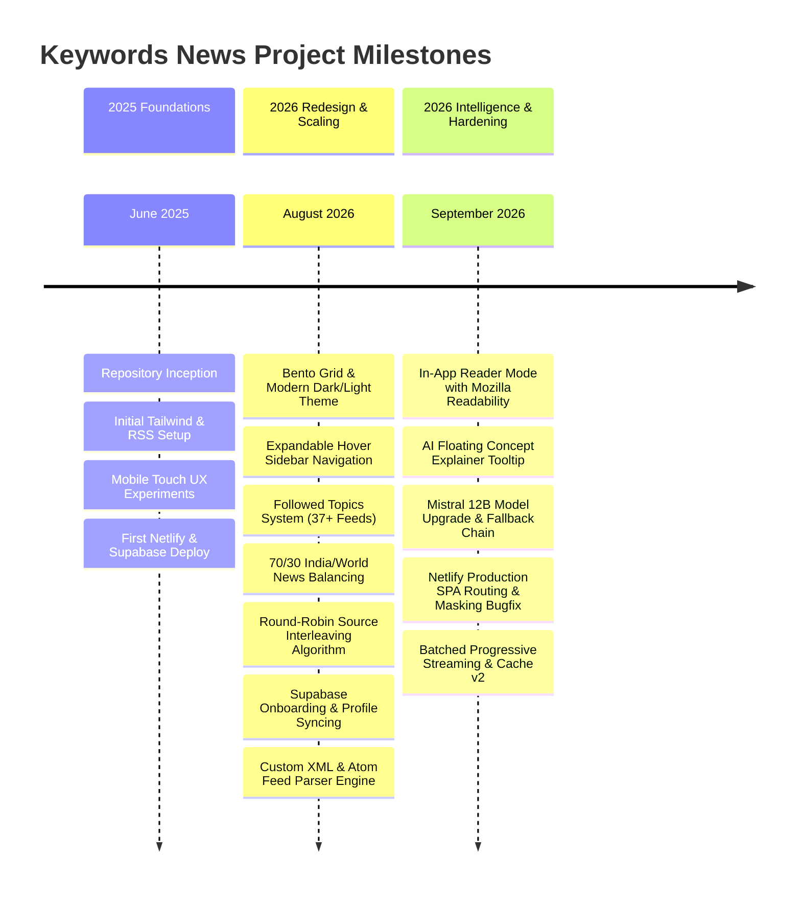
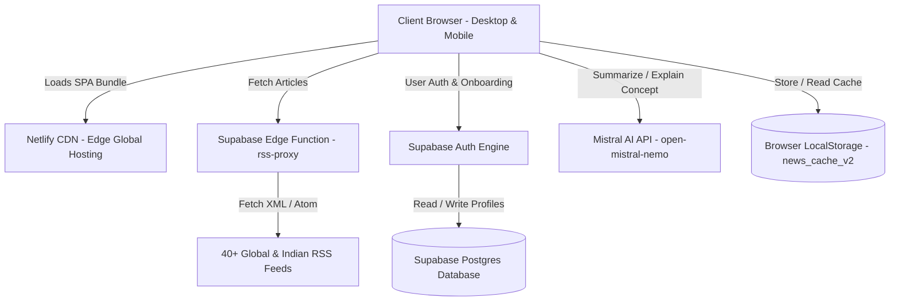
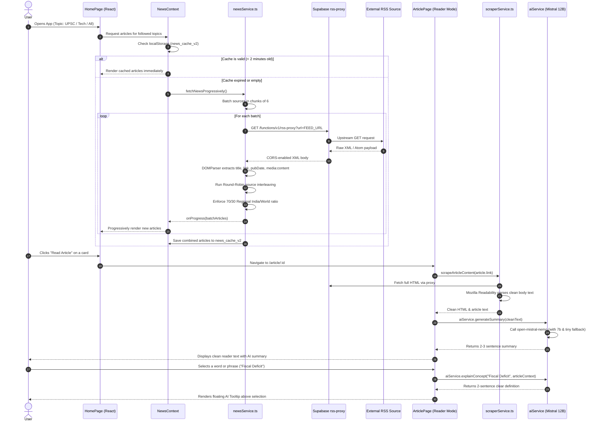

# Keywords News — Comprehensive Developer Guide & Technical Handover Manual

> **Product:** Keywords News  
> **Live Production URL:** [https://keywordnews.netlify.app](https://keywordnews.netlify.app)  
> **Repository:** [github.com/sushrutverma/KeywordNewsLive](https://github.com/sushrutverma/KeywordNewsLive)  
> **Target Audience:** Incoming software engineers, maintainers, and non-technical product owners.  
> **Last Updated:** September 2026  

---

## 📖 Table of Contents
1. [The Philosophy & Vision](#1-the-philosophy--vision)
2. [Complete Timeline of Updates & Evolution](#2-complete-timeline-of-updates--evolution)
3. [The Hall of Solved Engineering Challenges](#3-the-hall-of-solved-engineering-challenges)
4. [Full Technical Architecture & System Design](#4-full-technical-architecture--system-design)
5. [File-by-File & Directory Guide](#5-file-by-file--directory-guide)
6. [Data Flow: Lifecycle of a News Article](#6-data-flow-lifecycle-of-a-news-article)
7. [Complete Database Architecture & Supabase Schema (SQL DDL)](#7-complete-database-architecture--supabase-schema-sql-ddl)
8. [Third-Party Infrastructure & Service Ownership Map](#8-third-party-infrastructure--service-ownership-map)
9. [Client-Side State, React Query & Storage Map](#9-client-side-state-react-query--storage-map)
10. [Security Boundaries & Secret Management](#10-security-boundaries--secret-management)
11. [Environment Variables & Credentials Reference](#11-environment-variables--credentials-reference)
12. [Developer Playbook: Local Setup, Build & Bundle Optimization](#12-developer-playbook-local-setup-build--bundle-optimization)
13. [How-To Recipes: Adding Sources, Topics & AI Features](#13-how-to-recipes-adding-sources-topics--ai-features)
14. [Quality Assurance Checklist & Emergency Runbook](#14-quality-assurance-checklist--emergency-runbook)

---

## 1. The Philosophy & Vision

### Why Keywords News Was Born
The modern news ecosystem is overwhelmed by two distinct failures:
1. **Algorithmic Outrage & Addiction:** Platforms like X (Twitter), Facebook, and Instagram optimize for outrage, rage-clicks, and hyper-polarizing commentary rather than factual depth.
2. **Paywalls, Ads & Feed Clutter:** Major news outlets load dozens of trackers, intrusive pop-ups, and auto-playing videos. Furthermore, single mainstream outlets publish dozens of micro-bulletins per hour, drowning out analytical journalism.

**Keywords News** was created as an intentional, serene, and intelligent reading space:
- **Zero Algorithmic Dopamine:** No endless addictive feeds. The news is categorized by distinct, high-intent interests (UPSC & Policy, Tech & Design, Men's Style, Running, Auto, Photography).
- **The 70/30 Regional Balance:** Enforces a strict ratio of **70% Indian National/Regional Coverage** and **30% Global International Reporting** so readers stay rooted in domestic policy without losing global context.
- **Round-Robin Diversity:** Prevents high-volume outlets (like Times of India) from dominating the feed, interleaving diverse publications evenly.
- **Distraction-Free In-App Reader:** Pulls full text using Mozilla Readability, stripping away ads, clutter, and trackers.
- **On-Demand Cognitive AI:** Instead of hallucinated AI news, AI is used strictly as an assistant: concise 2-3 sentence summaries, and an on-demand floating **Concept Explainer** for complex policy and technical jargon.

> **Note for Non-Technical Owners:**  
> This guide is written with sufficient context so that even if you do not write code, you can hand this document to any frontend or full-stack software engineer and they will immediately understand every line of code, architectural decision, and past bugfix in this project without needing external guidance.

---

## 2. Complete Timeline of Updates & Evolution



### Detailed Chronology of Changes

#### Milestone 1: Foundations (June 2025)
- **Commits `6813880` → `87c6acb`**: Project scaffolded with React, TypeScript, and Vite.
- Initial RSS integration created to fetch headlines directly.
- Experiments with mobile scroll indicators (`ScrollNavigator`) were created, iterated on, and eventually deprecated in favor of native mobile browser gestures.
- Initial Netlify deployment and Supabase migrations established.

#### Milestone 2: Bento Grid & UI Overhaul (Early August 2026)
- **Commit `4d6b9ee`**: Full visual redesign implementing glassmorphism, responsive Bento grids, subtle dark/light mode switches, and custom typography (Playfair Display for headlines, Lora for body text, Plus Jakarta Sans for UI controls).
- **Commits `9004abc` → `b18decf`**: Replaced standard navigation with an expandable desktop hover sidebar (compact 76px icon rail that smoothly widens to 260px on hover) and a mobile slide-over drawer.

#### Milestone 3: Content Engineering & Source Diversity (Mid August 2026)
- **Commit `a80e60d`**: Expanded RSS catalog across 7 specialized topic verticals.
- **Commit `98aa06b`**: Introduced the 70/30 regional balance rule ensuring India-centric priority.
- **Commit `2432be7`**: Developed the **Round-Robin Source Interleaving Algorithm** to prevent single publications from capturing the feed.
- **Commit `cd888a6` & `0469141`**: Added the 3-step personalized onboarding wizard, capturing occupation, reading goals, and syncing to the Supabase `profiles` table.
- **Commit `51b2e5a`**: Rebuilt the RSS XML parser using browser-native `DOMParser` with dual-mode RSS 2.0 and Atom XML compatibility.

#### Milestone 4: Reader Mode & AI Intelligence (September 2026)
- Created the in-app Reader Mode in `ArticlePage.tsx` using `@mozilla/readability` to scrape and render clean article text.
- Built the **AI Floating Concept Explainer**: users select 2-6 words of confusing terminology, and a floating tooltip pops up with a 2-sentence explanation.
- Upgraded the AI summarization pipeline to Mistral AI's `open-mistral-nemo` (12B) with multi-model fallback.

#### Milestone 5: Production Hardening & Reliability (September 2026)
- Fixed Netlify SPA routing 404s with `_redirects` and `netlify.toml`.
- Discovered and eliminated Netlify's remote environment variable masking bug.
- Converted RSS fetching to a concurrent 6-source streaming pipeline with `news_cache_v2`.

---

## 3. The Hall of Solved Engineering Challenges

Every real-world production app faces unexpected failure modes. Below is the historical record of major technical hurdles encountered in Keywords News, their root causes, and how they were permanently fixed.

### Challenge 1: Browser CORS & RSS Feed Blocking
- **The Problem:** Modern web browsers enforce strict Same-Origin Policies (CORS). Directly calling `fetch('https://www.thehindu.com/feeder/default.rss')` from browser JavaScript is blocked by the browser with `CORS header 'Access-Control-Allow-Origin' missing`. Public proxies like `cors-anywhere` and `allorigins.win` are heavily rate-limited and unreliable.
- **The Solution:** Built a dedicated Deno Edge Function in Supabase (`supabase/functions/rss-proxy/index.ts`). The frontend requests the feed through our Supabase proxy, which fetches the upstream XML on the server side and returns it to the client with valid `Access-Control-Allow-Origin: *` headers.

### Challenge 2: Feed Monopolization by High-Frequency Publishers
- **The Problem:** High-volume publishers (e.g., Times of India) publish 50+ articles an hour, while specialized publications (e.g., Livemint or The Hindu) publish fewer, high-depth analytical pieces. Sorting simply by publication timestamp resulted in 10 consecutive articles from the same publisher.
- **The Solution:** Implemented the **Round-Robin Interleaving Algorithm** in `newsService.ts`:
  1. Articles are grouped into buckets by publisher name.
  2. The algorithm rotates through the buckets, drawing 1 article from each until all articles are distributed.
  3. The result is an evenly distributed feed where readers never see the same publisher twice in a row.

### Challenge 3: Indian vs. International Content Imbalance
- **The Problem:** Global tech and world news feeds generate vastly more RSS volume than niche Indian policy feeds. Without curation, the platform felt like a generic US tech blog rather than an India-focused daily briefing.
- **The Solution:** Added explicit `isIndian: boolean` flags to each source in `newsSources.ts`. Created `mixRegionalArticles()` which enforces a strict **70/30 interleaving loop** (7 Indian articles followed by 3 World articles) across the main feed.

### Challenge 4: Mistral AI 429 Rate Limiting on Free Tier
- **The Problem:** The initial implementation used `mistral-small-latest`. During active usage, Mistral returned HTTP `429 Too Many Requests` (Quota Exceeded) because smaller legacy tiers have low concurrent requests per minute.
- **The Solution:** 
  1. Switched primary model to `open-mistral-nemo` (12B parameters), which offers higher token limits and superior synthesis.
  2. Implemented an automatic three-tier fallback mechanism in `aiService.ts` (`open-mistral-nemo` → `open-mistral-7b` → `mistral-tiny`).
  3. Pre-trimmed incoming article text to 3,000 characters to prevent excessive context-window consumption.

### Challenge 5: Netlify Remote Build Environment Variable Masking
- **The Problem:** When building on Netlify's remote servers, the Supabase API key was getting injected with literal masked asterisks (`****************KilA` and `****************OXVq`) instead of the actual key values. This caused silent `401 Unauthorized` errors on the production site.
- **The Solution:**
  1. Used `netlify env:set` to re-sync authentic keys.
  2. Established the **Prebuilt Production Deployment Workflow**: The developer runs `npm run build` locally (where `.env` has the authentic raw keys) and deploys the prebuilt `dist/` folder directly using `netlify deploy --prod --dir dist --no-build`.

### Challenge 6: Direct Link & Refresh 404 Errors (SPA Routing)
- **The Problem:** Navigating to `/article/123` or `/saved` directly in the browser address bar returned a Netlify 404 page because the physical file `/article/123.html` does not exist on the server.
- **The Solution:** Added `public/_redirects` with `/* /index.html 200` and `netlify.toml` redirect rules. This forces Netlify to route all incoming HTTP requests to `index.html`, allowing `react-router-dom` to handle client-side routing smoothly.

---

## 4. Full Technical Architecture & System Design



---

## 5. File-by-File & Directory Guide

```
KeywordsNews/
├── public/
│   ├── _redirects              # Netlify SPA redirect rule (/* /index.html 200)
│   ├── manifest.json           # Web App Manifest for PWA installation
│   └── vite.svg                # Application favicon
├── src/
│   ├── components/
│   │   ├── ArticleCard.tsx     # Bento grid card component with animations, share, bookmark, and AI modal
│   │   ├── ArticleSkeleton.tsx # Shimmer loading skeletons while articles are being fetched
│   │   ├── DurationFilter.tsx  # User filter preference (24h, 3d, 1w, 2w, 1m)
│   │   ├── Header.tsx          # Responsive top bar with search toggle, theme switch, mobile menu
│   │   ├── SearchBar.tsx       # Keyword search input with autocomplete suggestions
│   │   ├── SearchModal.tsx     # Fullscreen overlay search experience with history
│   │   ├── Sidebar.tsx         # Expandable hover sidebar (desktop) + drawer (mobile)
│   │   └── ThemeToggle.tsx     # Animated dark/light mode toggle
│   ├── contexts/
│   │   ├── AuthContext.tsx     # Supabase auth session, user profile sync, login/logout
│   │   ├── NewsContext.tsx     # Central news state: feed fetching, topic tabs, search filtering
│   │   ├── SearchHistoryContext.tsx # User's recent search queries stored in localStorage
│   │   └── ThemeContext.tsx    # Theme provider controlling 'dark' class on <html>
│   ├── lib/
│   │   └── supabase.ts         # Supabase client initialization using VITE_SUPABASE_URL and ANON_KEY
│   ├── pages/
│   │   ├── ArticlePage.tsx     # Full reader mode with Mozilla Readability, AI summary & floating explainer
│   │   ├── HomePage.tsx        # Main bento feed, topic horizontal tab bar, pull-to-refresh
│   │   ├── LoginPage.tsx       # Clean login interface with validation and error surfacing
│   │   ├── OnboardingPage.tsx  # 3-step post-signup profile wizard (name, occupation, reading goals)
│   │   ├── SavedArticlesPage.tsx # Bookmark library with search and batch management
│   │   ├── SettingsPage.tsx    # User profile settings, theme selector, topic subscription manager
│   │   └── SignupPage.tsx      # Registration screen linked to onboarding wizard
│   ├── services/
│   │   ├── aiService.ts        # Mistral AI client with multi-model fallback, cleanText, and token limiter
│   │   ├── newsService.ts      # Feed proxy fetcher, DOMParser, 70/30 regional mixer, round-robin interleaver
│   │   ├── newsSources.ts      # Master registry of 40 news publications with category & regional flags
│   │   └── scraperService.ts   # Client-side web scraper using Mozilla Readability for distraction-free reading
│   ├── types.ts                # TypeScript interfaces: Article, NewsSource, Topic, UserProfile
│   ├── App.tsx                 # Top-level routing, query client provider, protected route guard
│   ├── main.tsx                # React DOM root mounting
│   └── index.css               # Design system, glassmorphism tokens, reader typography, custom scrollbars
├── supabase/
│   ├── functions/
│   │   └── rss-proxy/index.ts  # Deno Edge Function proxying RSS feeds with CORS headers
│   └── migrations/             # SQL schema definitions for Supabase profiles table
├── netlify.toml                # Root Netlify configuration: build commands and redirect handling
├── package.json                # Dependencies and npm build scripts
├── tailwind.config.js          # Tailwind styling tokens and custom colors
├── vite.config.ts              # Vite bundler options and module aliases
├── TODO.md                     # Prioritized future roadmap (Sprint 1, 2, 3)
└── DEVELOPER_GUIDE.md          # This technical manual
```

---

## 6. Data Flow: Lifecycle of a News Article



---

## 7. Complete Database Architecture & Supabase Schema (SQL DDL)

Keywords News uses **Supabase (PostgreSQL 15+)** for user identity and personalization.  
If you are setting up a brand new Supabase project or replicating this database from scratch, run the following complete idempotent SQL script in the **Supabase SQL Editor**:

```sql
-- 1. Create the public.profiles table
CREATE TABLE IF NOT EXISTS public.profiles (
  id uuid PRIMARY KEY REFERENCES auth.users(id) ON DELETE CASCADE,
  email text,
  full_name text,
  occupation text,
  reading_goal integer DEFAULT 15,
  followed_topics text[] DEFAULT '{}'::text[],
  article_duration_filter text DEFAULT '7 days',
  created_at timestamptz DEFAULT now(),
  updated_at timestamptz DEFAULT now()
);

-- 2. Enable Row Level Security (RLS)
ALTER TABLE public.profiles ENABLE ROW LEVEL SECURITY;

-- 3. Create RLS Policies
-- Users can only read their own profile row
DO $$ 
BEGIN
  IF NOT EXISTS (
    SELECT 1 FROM pg_policies 
    WHERE tablename = 'profiles' AND policyname = 'Users can read own profile'
  ) THEN
    CREATE POLICY "Users can read own profile"
      ON public.profiles FOR SELECT
      TO authenticated
      USING (auth.uid() = id);
  END IF;

  -- Users can only update their own profile row
  IF NOT EXISTS (
    SELECT 1 FROM pg_policies 
    WHERE tablename = 'profiles' AND policyname = 'Users can update own profile'
  ) THEN
    CREATE POLICY "Users can update own profile"
      ON public.profiles FOR UPDATE
      TO authenticated
      USING (auth.uid() = id)
      WITH CHECK (auth.uid() = id);
  END IF;

  -- Users can only insert their own profile row
  IF NOT EXISTS (
    SELECT 1 FROM pg_policies 
    WHERE tablename = 'profiles' AND policyname = 'Users can insert own profile'
  ) THEN
    CREATE POLICY "Users can insert own profile"
      ON public.profiles FOR INSERT
      TO authenticated
      WITH CHECK (auth.uid() = id);
  END IF;
END $$;

-- 4. Create Automatic updated_at Timestamp Trigger
CREATE OR REPLACE FUNCTION public.update_updated_at_column()
RETURNS TRIGGER AS $$
BEGIN
  NEW.updated_at = now();
  RETURN NEW;
END;
$$ LANGUAGE plpgsql;

DROP TRIGGER IF EXISTS update_profiles_updated_at ON public.profiles;
CREATE TRIGGER update_profiles_updated_at
  BEFORE UPDATE ON public.profiles
  FOR EACH ROW
  EXECUTE FUNCTION public.update_updated_at_column();
```

### Deploying the Supabase Edge Function (`rss-proxy`)
The edge function resides in `supabase/functions/rss-proxy/index.ts`. It runs on Deno and proxies RSS requests while injecting CORS headers.

```bash
# Step 1: Install Supabase CLI locally (if not already present)
npm install -g supabase

# Step 2: Login to your Supabase account
npx supabase login

# Step 3: Link to the Keywords News project
# Replace [project-ref] with your project ID (e.g. jwksmchxpprxkpbsmhxo)
npx supabase link --project-ref jwksmchxpprxkpbsmhxo

# Step 4: Deploy the function with public access (--no-verify-jwt is critical so RSS fetches don't require user login)
npx supabase functions deploy rss-proxy --no-verify-jwt
```

---

## 8. Third-Party Infrastructure & Service Ownership Map

For non-technical owners and new developers, this matrix lists all external services powering Keywords News:

| Service | Purpose | Project / Account Identifier | Free Tier Limits & Thresholds | What to Do If Exceeded |
| :--- | :--- | :--- | :--- | :--- |
| **Netlify** | Web hosting, SPA routing, SSL, continuous delivery | Site: `keywordnews.netlify.app`<br>ID: `a0e3c54d-6a5c-43f1-b924-adfe8423ef82` | 100 GB bandwidth/mo, 300 build mins/mo | Upgrade to Pro ($19/mo) or migrate to Cloudflare Pages. |
| **Supabase** | Auth, Postgres Database, Deno Edge Functions | Project Ref: `jwksmchxpprxkpbsmhxo`<br>Region: `ap-south-1` (Mumbai) | 500 MB DB, 50,000 monthly active users, 500k edge function calls | Upgrade to Pro ($25/mo) if active users exceed 50k. |
| **Mistral AI** | Article Summaries & Concept Explainer Tooltips | Model: `open-mistral-nemo`<br>Console: [console.mistral.ai](https://console.mistral.ai) | Pay-as-you-go credit pool ($0.15 / 1M tokens) | If summaries fail with 401/429, add credits in Mistral billing dashboard. |
| **Resend** | Transactional email digests (Sprint 3) | Domain: `keywordnews.app`<br>Console: [resend.com](https://resend.com) | 3,000 emails/month free | Upgrade to Pro ($20/mo for 50,000 emails). |
| **GitHub** | Code repository & version history | `sushrutverma/KeywordNewsLive` | Unlimited public/private repository storage | N/A |

---

## 9. Client-Side State, React Query & Storage Map

Keywords News uses a hybrid storage model: Supabase for persistent cloud profiles, and the browser's `localStorage` for rapid, zero-latency local caching.

### Browser LocalStorage Schema

| Key Name | Data Type | Default Value | Purpose & Invalidation Rules |
| :--- | :--- | :--- | :--- |
| `news_cache_v2` | JSON stringified `Article[]` | `null` | Stores parsed articles to prevent re-fetching on page navigation. |
| `news_cache_timestamp_v2` | Millisecond timestamp string | `null` | Evaluated against `CACHE_DURATION` (120,000 ms = 2 minutes). Expired data triggers fresh background fetch. |
| `savedArticles` | JSON stringified `Article[]` | `[]` | Bookmarked articles saved by the user. Persists indefinitely until removed by user. |
| `followedTopics` | JSON stringified `string[]` | `["upsc-policy", "tech-design", ...]` | Array of 7 topic IDs that appear in the user's top navigation bar. |
| `searchHistory` | JSON stringified `string[]` | `[]` | Recent search keyword queries, capped at 10 items. |
| `theme` | String (`'light'` \| `'dark'`) | System preference | Controls the CSS `.dark` class on the root `<html>` tag. |

### Quota Exceeded & Cache Corruption Defense
If a user's browser storage becomes full or corrupted, `newsService.ts` catches `JSON.parse` errors gracefully, logs a warning, wipes `news_cache_v2`, and fetches a fresh feed without crashing the UI.

---

## 10. Security Boundaries & Secret Management

> [!IMPORTANT]
> **Understanding Frontend vs. Backend Security in Vite:**
> Any environment variable beginning with `VITE_` is automatically compiled and bundled directly into public JavaScript files. **Anyone who opens the browser DevTools can inspect these values.**

### The Three Rules of Secrets in Keywords News:
1. **`VITE_SUPABASE_ANON_KEY` is public by design:** This key allows browsers to communicate with Supabase. It is completely safe to be public because **Supabase Row Level Security (RLS)** prevents unauthorized database queries. Unauthenticated users cannot read or modify other users' profiles.
2. **`SUPABASE_SECRET_KEY` must NEVER have a `VITE_` prefix:** The Supabase Service Role key bypasses all RLS policies. It is used strictly for internal backend scripts and must NEVER be placed in `.env` with a `VITE_` prefix or imported into `src/`.
3. **Mistral AI Key Architecture:** `VITE_MISTRAL_API_KEY` is currently called from the client for rapid prototyping. For commercial production scale, incoming developers should route AI completions through an authenticated Supabase Edge Function (`supabase/functions/mistral-proxy`) so the API key never touches client browsers.

---

## 11. Environment Variables & Credentials Reference

All environment variables used by the application must be declared in the root `.env` file for local development, and mirrored into **Netlify Dashboard → Site Configuration → Environment Variables** for production.

| Variable Name | Required By | Sample Format / Purpose | Where to Obtain |
| :--- | :--- | :--- | :--- |
| `VITE_SUPABASE_URL` | Frontend & Vite | `https://[project-ref].supabase.co` | Supabase Dashboard → Settings → API |
| `VITE_SUPABASE_ANON_KEY` | Frontend & Vite | `sb_publishable_[token]` or JWT | Supabase Dashboard → Settings → API (Project API keys: `anon/public`) |
| `VITE_MISTRAL_API_KEY` | Frontend (aiService) | `[32-char alphanumeric string]` | [console.mistral.ai](https://console.mistral.ai) → API Keys |
| `VITE_MISTRAL_MODEL` | Optional override | `open-mistral-nemo` (Default) | Optional: set to any supported Mistral model |
| `SUPABASE_URL` | Backend / Scripts | `https://[project-ref].supabase.co` | Supabase Project Settings |
| `SUPABASE_SECRET_KEY` | Backend admin | `sb_secret_[token]` (Never expose to client!) | Supabase Project Settings |
| `RESEND_API_KEY` | Email digests | `re_[token]` | [resend.com](https://resend.com) → API Keys |

> [!WARNING]
> **Never commit your `.env` file to Git.** It is listed in `.gitignore`.  
> If an API key is accidentally committed, revoke it immediately in the provider's dashboard and generate a replacement.

---

## 12. Developer Playbook: Local Setup, Build & Bundle Optimization

### 1. Prerequisites
- **Node.js:** v18.0.0 or higher (tested on Node v22).
- **npm:** v9.0.0 or higher.
- **Git:** Installed on local machine.

### 2. Local Setup
```bash
# 1. Clone the repository
git clone https://github.com/sushrutverma/KeywordNewsLive.git
cd KeywordNewsLive

# 2. Install dependencies
npm install

# 3. Create your local .env file
# Ensure VITE_SUPABASE_URL, VITE_SUPABASE_ANON_KEY, and VITE_MISTRAL_API_KEY are filled.

# 4. Start the development server
npm run dev
```
The app will launch at `http://localhost:5173`.

### 3. Production Build & Validation
```bash
# Validate that TypeScript and Vite compile with zero errors:
npm run build

# Preview the production build locally:
npm run preview
```

### 4. Deploying to Netlify (The "Gold Standard" Recipe)
To prevent the remote Netlify environment from overriding your authentic API credentials with masked asterisks:

```bash
# Step 1: Compile the project locally using your verified .env file
npm run build

# Step 2: Deploy the prebuilt 'dist' folder directly with --no-build
node node_modules/netlify/bin/run.js deploy --prod --dir dist --no-build
```

### 5. Bundle Size Optimization Recipe (`vite.config.ts`)
To resolve the Vite `>500kB` warning and optimize page load speed, configure manual chunk splitting in `vite.config.ts`:

```typescript
// vite.config.ts
import { defineConfig } from 'vite';
import react from '@vitejs/plugin-react';

export default defineConfig({
  plugins: [react()],
  build: {
    rollupOptions: {
      output: {
        manualChunks: {
          'vendor-react': ['react', 'react-dom', 'react-router-dom'],
          'vendor-icons': ['lucide-react'],
          'vendor-query': ['@tanstack/react-query'],
          'vendor-supabase': ['@supabase/supabase-js'],
        },
      },
    },
    chunkSizeWarningLimit: 600,
  },
});
```

---

## 13. How-To Recipes: Adding Sources, Topics & AI Features

### Recipe 1: How to Add a New RSS News Source
1. Open [src/services/newsSources.ts](file:///c:/Users/sushr/OneDrive/Desktop/New%20folder/KeywordsNews/src/services/newsSources.ts).
2. Append a new object to the `news_sources` array:
```typescript
{
  name: "MIT Technology Review",
  url: "https://www.technologyreview.com/feed/",
  category: "tech-design", // Must match an existing topic id
  isIndian: false,         // true = Indian national/regional, false = International
  richContent: true        // true = Long-form/analytical, false = News wire
}
```
3. Save the file. The new source will automatically be fetched, balanced, and interleaved on the next reload.

### Recipe 2: How to Add a New Topic Vertical
1. Open [src/services/newsSources.ts](file:///c:/Users/sushr/OneDrive/Desktop/New%20folder/KeywordsNews/src/services/newsSources.ts).
2. Add the topic definition to `topics`:
```typescript
{
  id: "climate-energy",
  name: "Climate & Energy",
  description: "Renewable energy, climate policy, and environmental science."
}
```
3. Add sources belonging to this topic in `news_sources` with `category: "climate-energy"`.
4. Open [src/contexts/NewsContext.tsx](file:///c:/Users/sushr/OneDrive/Desktop/New%20folder/KeywordsNews/src/contexts/NewsContext.tsx) and add `"climate-energy"` to the default `followedTopics` array so new users see it by default.

### Recipe 3: How to Update or Switch AI Models
Open [src/services/aiService.ts](file:///c:/Users/sushr/OneDrive/Desktop/New%20folder/KeywordsNews/src/services/aiService.ts).
Modify the `CANDIDATE_MODELS` array:
```typescript
const CANDIDATE_MODELS = [
  import.meta.env.VITE_MISTRAL_MODEL || 'open-mistral-nemo', // Primary
  'open-mistral-7b',                                         // First fallback
  'mistral-tiny'                                             // Final fallback
];
```

---

## 14. Quality Assurance Checklist & Emergency Runbook

### Pre-Flight Verification Checklist
Before shipping any update to production, run through this 5-point manual test:
1. **70/30 Regional Ratio Test:** Load the homepage. Verify that out of every 10 articles, approximately 7 originate from Indian publications and 3 from international sources.
2. **Round-Robin Diversity Test:** Verify that the same publisher never appears consecutively more than twice in the bento feed.
3. **Reader Mode Test:** Click any article card. Verify the reader view loads clean typography without banner ads or raw HTML artifacts.
4. **AI Summary & Explainer Test:** Click "Generate AI Summary". Highlight a phrase (e.g., "Fiscal Deficit") and confirm the floating tooltip generates a 2-sentence explanation.
5. **Auth & Onboarding Test:** Create a test user account. Confirm completion of the 3 onboarding steps redirects to the homepage and populates `public.profiles` in Supabase.

### Emergency Runbook

#### Issue A: "Articles stopped loading / Feed is empty"
1. **Check Netlify Keys:** Verify whether `dist/assets/index-[hash].js` contains `sb_publishable_...` or if it has `****************`. If it has asterisks, run `node node_modules/netlify/bin/run.js env:set VITE_SUPABASE_ANON_KEY [real_key]` and redeploy with `--no-build`.
2. **Clear Client Cache:** Open browser DevTools → Application → Local Storage → Delete `news_cache_v2` and `news_cache_timestamp_v2` → Refresh page.
3. **Verify Edge Proxy:** Run in terminal:
   ```bash
   node -e "fetch('https://jwksmchxpprxkpbsmhxo.supabase.co/functions/v1/rss-proxy?url=https%3A%2F%2Fwww.thehindu.com%2Ffeeder%2Fdefault.rss', { headers: { Authorization: 'Bearer [YOUR_ANON_KEY]' } }).then(r => console.log('STATUS:', r.status))"
   ```
   If it returns 200, the proxy is healthy.

#### Issue B: "AI Summary fails with 'Invalid API Key' or 401"
1. Verify `VITE_MISTRAL_API_KEY` in `.env`.
2. Test key directly:
   ```bash
   node -e "fetch('https://api.mistral.ai/v1/chat/completions', { method: 'POST', headers: { 'Authorization': 'Bearer [YOUR_MISTRAL_KEY]', 'Content-Type': 'application/json' }, body: JSON.stringify({ model: 'open-mistral-nemo', messages: [{ role: 'user', content: 'hi' }] }) }).then(r => r.json()).then(console.log)"
   ```
3. If it returns an error, the Mistral API key has expired or exhausted its quota at [console.mistral.ai](https://console.mistral.ai).

#### Issue C: "Direct link or page refresh produces a 404"
1. Check that `public/_redirects` exists and contains:
   ```
   /*    /index.html   200
   ```
2. Check that `netlify.toml` in the project root contains:
   ```toml
   [[redirects]]
     from = "/*"
     to = "/index.html"
     status = 200
   ```

---

## 🏁 Summary & Handover Note

This codebase is structured with standard, modern web technologies:
- **No proprietary framework locks:** Standard React 18, Vite 6, and Vanilla/Tailwind CSS.
- **No fragile build steps:** Straightforward `npm run build`.
- **Completely modular:** Services (`aiService.ts`, `newsService.ts`, `scraperService.ts`) are decoupled from UI components.

Any developer with foundational React and TypeScript knowledge will be able to maintain, optimize, and expand this platform with complete confidence.
